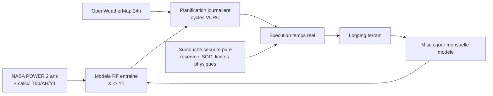
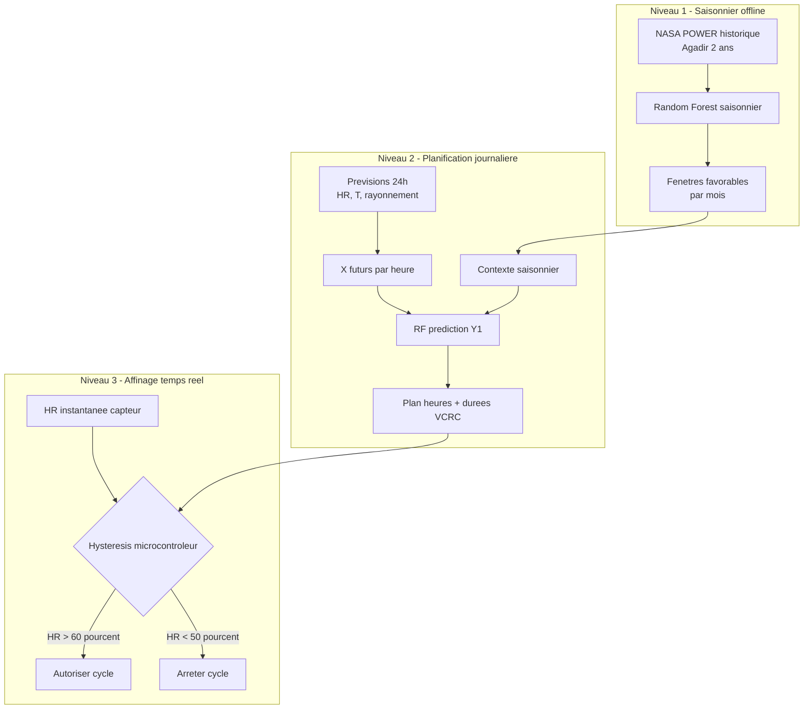
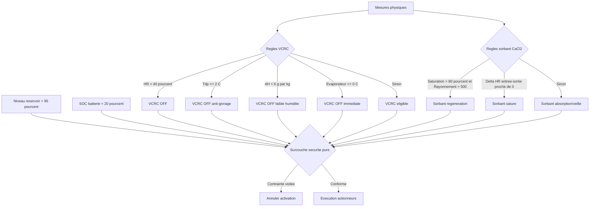

## Diagramme Mermaid - Vue globale lisible

## Diagramme Mermaid - Couche IA (3 niveaux)

## Diagramme Mermaid - Couche regles heritees utiles

## Ce qui change vs ancienne logique

1. L IA ne sort plus des commandes finales multi-actionneurs: elle predit surtout Y1 pour planifier.
2. Le pilotage instantane est confie a l hysteresis microcontroleur, pour supprimer le chattering.
3. Les regles physiques historiques VCRC/Sorbant sont conservees, mais placees dans une couche de validation dure.
4. La surcouche securite pure garde l autorite finale sur toute activation.
5. L adaptation du modele passe par une boucle de feedback mensuelle, pas par correction decisionnelle continue en ligne.