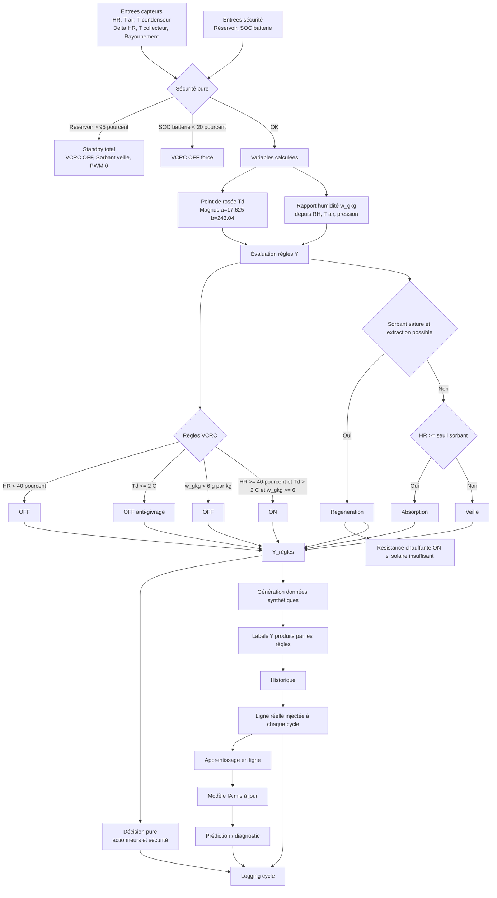
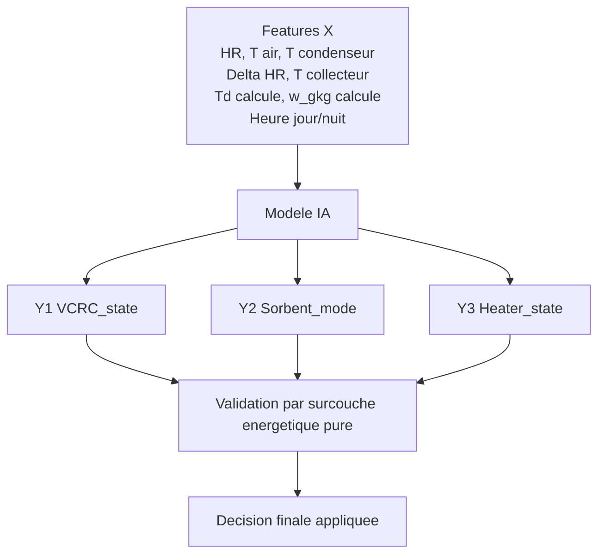
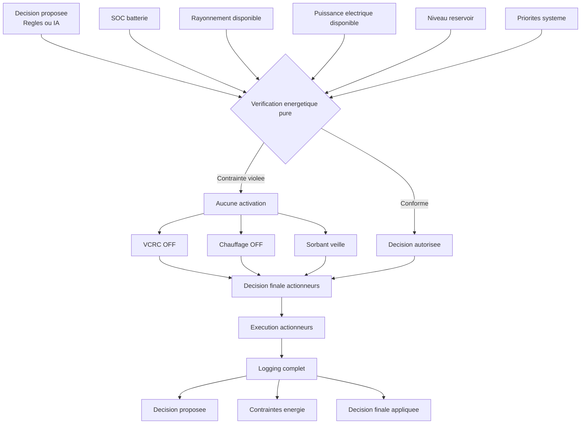

# Diagramme Mermaid - Regles Metier AQUA-ATMOS

```mermaid
flowchart TD
    A[Entrees capteurs<br/>HR, T air, T condenseur<br/>Delta HR, T collecteur, Rayonnement] --> S{Sécurité pure}
    A2[Entrees sécurité<br/>Réservoir, SOC batterie] --> S

    S -->|Réservoir > 95 pourcent| S1[Standby total<br/>VCRC OFF, Sorbant veille, PWM 0]
    S -->|SOC batterie < 20 pourcent| S2[VCRC OFF forcé]
    S -->|OK| B[Variables calculées]

    B --> B1[Point de rosée Td<br/>Magnus a=17.625 b=243.04]
    B --> B2[Rapport humidité w_gkg<br/>depuis RH, T air, pression]

    B1 --> R[Évaluation règles Y]
    B2 --> R

    R --> V{Règles VCRC}
    V -->|HR < 40 pourcent| V1[OFF]
    V -->|Td <= 2 C| V2[OFF anti-givrage]
    V -->|w_gkg < 6 g par kg| V3[OFF]
    V -->|HR >= 40 pourcent et Td > 2 C et w_gkg >= 6| V4[ON]

    R --> M{Sorbant sature et extraction possible}
    M -->|Oui| M1[Regeneration]
    M -->|Non| M2{HR >= seuil sorbant}

    M2 -->|Oui| M3[Absorption]
    M2 -->|Non| M4[Veille]

    M1 --> H1[Resistance chauffante ON si solaire insuffisant]

    V1 --> Y[Y_règles]
    V2 --> Y
    V3 --> Y
    V4 --> Y
    M1 --> Y
    M3 --> Y
    M4 --> Y

    Y --> D[Décision pure<br/>actionneurs et sécurité]

    Y --> G[Génération données synthétiques]
    G --> G1[Labels Y produits par les règles]
    G1 --> H[Historique]

    H --> R1[Ligne réelle injectée à chaque cycle]
    R1 --> L[Apprentissage en ligne]
    L --> AI[Modèle IA mis à jour]

    AI --> PRED[Prédiction / diagnostic]
    PRED --> LOG[Logging cycle]
    D --> LOG
    R1 --> LOG
```

## Diagramme Mermaid - Couche IA (X en entree, Y en sortie)

```mermaid
flowchart TD
    X[Features X<br/>HR, T air, T condenseur<br/>Delta HR, T collecteur<br/>Td calcule, w_gkg calcule<br/>Heure jour/nuit] --> M[Modele IA]
    M --> Y1[Y1 VCRC_state]
    M --> Y2[Y2 Sorbent_mode]
    M --> Y3[Y3 Heater_state]

    Y1 --> V[Validation par surcouche energetique pure]
    Y2 --> V
    Y3 --> V
    V --> D[Decision finale appliquee]
```

## Diagramme Mermaid - Surcouche Energetique Pure (sans autorite IA)

```mermaid
flowchart TD
    A[Decision proposee<br/>Regles ou IA] --> B{Verification energetique pure}
    E1[SOC batterie] --> B
    E2[Rayonnement disponible] --> B
    E3[Puissance electrique disponible] --> B
    E4[Niveau reservoir] --> B
    E5[Priorites systeme] --> B

    B -->|Contrainte violee| C[Aucune activation]
    C --> C1[VCRC OFF]
    C --> C2[Chauffage OFF]
    C --> C3[Sorbant veille]

    B -->|Conforme| D[Decision autorisee]

    C1 --> F[Decision finale actionneurs]
    C2 --> F
    C3 --> F
    D --> F

    F --> G[Execution actionneurs]
    G --> H[Logging complet]
    H --> H1[Decision proposee]
    H --> H2[Contraintes energie]
    H --> H3[Decision finale appliquee]
```