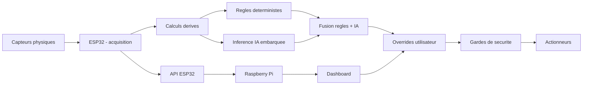
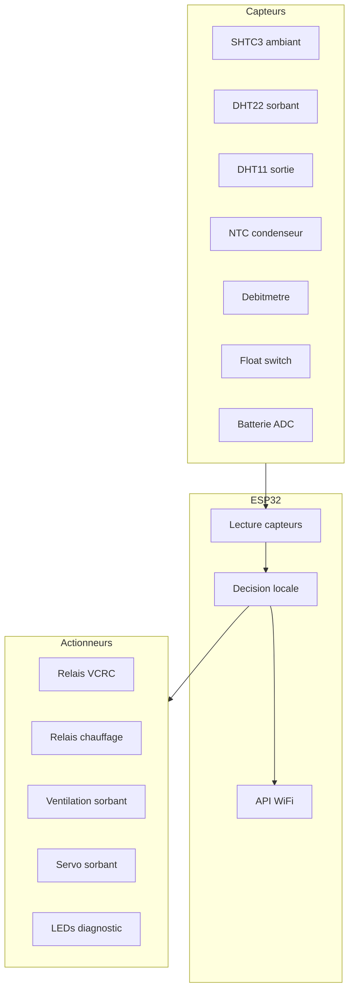
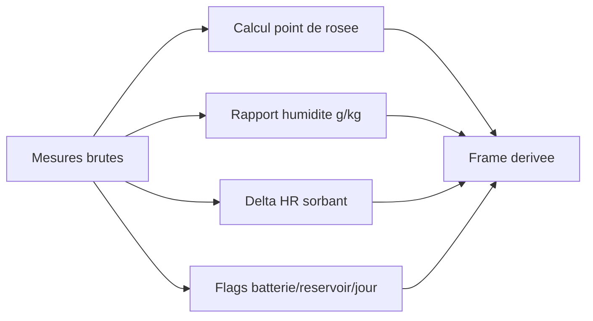
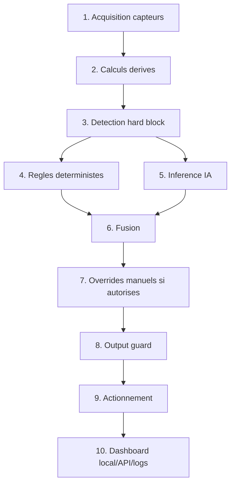
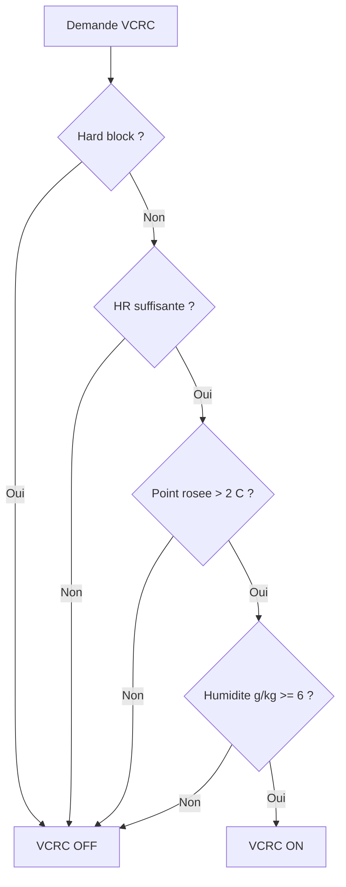
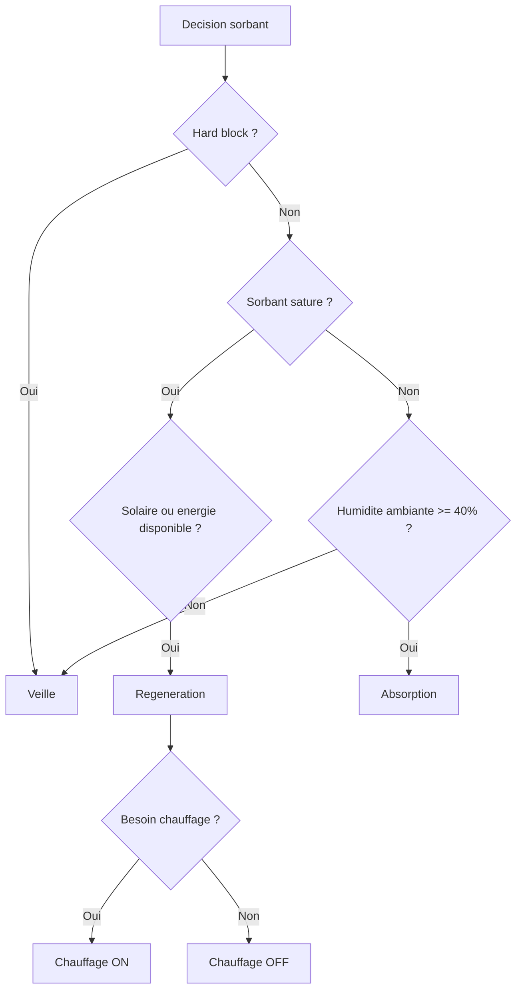
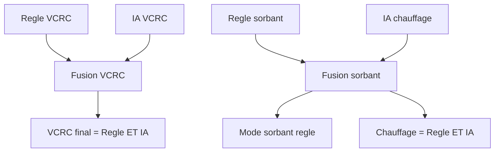
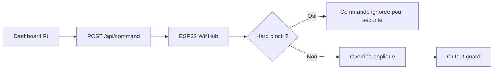
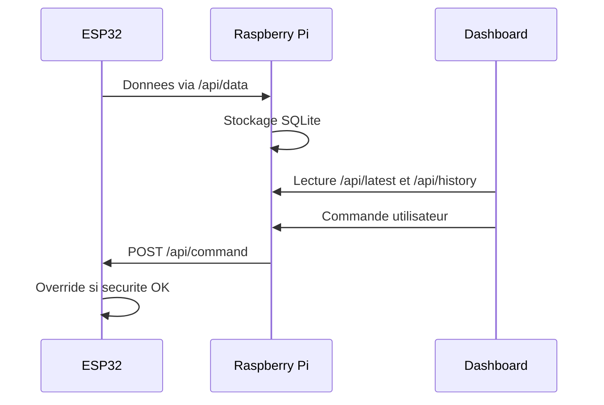
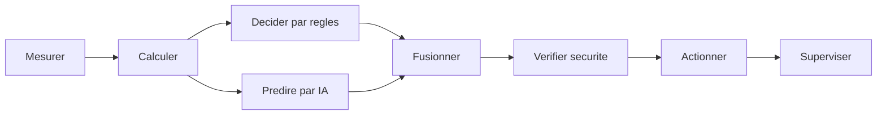

# AQUA-ATMOS - Architecture logique du systeme

Ce document explique la logique complete du systeme AQUA-ATMOS : comment les mesures physiques deviennent des decisions, puis des actions sur la machine. Il ne decrit pas l'organisation des fichiers, mais le fonctionnement global du projet.

## 1. Vue d'ensemble

AQUA-ATMOS est un systeme de production d'eau atmospherique pilote par ESP32. Le systeme observe l'air, l'etat du sorbant, la batterie, le reservoir et certaines temperatures critiques. A partir de ces donnees, il decide quand activer le VCRC, quand utiliser le module sorbant, quand regenerer le sorbant et quand couper les actionneurs pour raisons de securite.

Le Raspberry Pi ne prend pas la decision physique principale. Il supervise, stocke l'historique, affiche le dashboard et envoie des commandes manuelles a l'ESP32 quand l'utilisateur agit depuis l'interface.



## 2. Partie electronique

La partie electronique fournit les mesures et execute les decisions. L'ESP32 est le centre de controle. Il lit les capteurs, calcule les etats, pilote les relais, les ventilateurs, le servo et les LEDs.

### Entrees principales

| Fonction | Element | Pin ESP32 | Role logique |
|---|---:|---:|---|
| Bus I2C | SHTC3 / LCD | SDA 21, SCL 22 | Temperature/humidite ambiante et affichage |
| Sorbant | DHT22 | GPIO 5 | Temperature et humidite internes du module sorbant |
| Evaporateur / sortie | DHT11 | GPIO 18 | Humidite de sortie pour mesurer l'efficacite du sorbant |
| Condenseur | NTC 10K | GPIO 36 | Temperature critique pour securite thermique |
| Debit eau | Debitmetre | GPIO 14 | Production d'eau instantanee |
| Reservoir | Float switch | GPIO 32 | Detection de niveau haut / plein |
| Niveau reservoir | ADC | GPIO 33 | Niveau reservoir en pourcentage |
| Batterie | ADC | GPIO 34 | Estimation tension / etat de charge |

### Sorties principales

| Fonction | Actionneur | Pin ESP32 | Decision associee |
|---|---:|---:|---|
| Compression | Relais VCRC | GPIO 26 | `vcrc_relay_on` |
| Chauffage sorbant | Relais chauffage | GPIO 27 | `heater_relay_on` |
| Ventilation sorbant | Ventilateur PWM / relais | GPIO 25 | `fans_relay_on` |
| Orientation sorbant | Servo | GPIO 13 | `servo_angle_deg` |
| Alarme | LED rouge | GPIO 15 | Erreur / blocage |
| OK systeme | LED verte | GPIO 16 | Systeme actif sans erreur |
| VCRC | LED jaune | GPIO 17 | VCRC actif |
| Sorbant | LED bleue | GPIO 23 | Module sorbant actif |



## 3. Donnees mesurees et donnees derivees

Le systeme ne decide pas seulement a partir des valeurs brutes. Il enrichit les mesures avec des grandeurs physiques utiles.

### Mesures brutes

- Temperature air ambiant.
- Humidite relative ambiante.
- Temperature condenseur.
- Humidite interne sorbant.
- Humidite de sortie sorbant.
- Niveau reservoir.
- Etat float switch.
- Batterie / SOC.
- Production d'eau via debitmetre.
- Donnees solaires et temporelles quand disponibles.

### Donnees derivees

- Point de rosee.
- Rapport d'humidite en g/kg.
- Delta humidite sorbant : difference entre entree et sortie.
- Indicateurs temporels : heure, sinus/cosinus de l'heure et du jour.
- Indicateurs logiques : humidite haute, batterie en stress, reservoir haut, luminosite jour.
- Gains thermiques : ecarts temperature collecteur / air / condenseur.



## 4. Logique firmware ESP32

La boucle ESP32 suit toujours le meme ordre. Cette predictibilite est importante : les securites doivent pouvoir couper le systeme avant l'action physique.



### Hard block

Un hard block coupe la machine. Il est prioritaire sur les regles, l'IA et les commandes utilisateur.

Conditions actuelles :

- Reservoir plein : niveau > `95%`.
- Batterie critique : SOC < `20%`.
- Risque thermique : condenseur > `60 C`.
- Float switch actif.

Quand un hard block est actif :

- VCRC OFF.
- Sorbant en veille.
- Chauffage OFF.
- Sorties physiques remises a l'etat securise.

## 5. Regles deterministes

Les regles deterministes sont la base explicable du systeme. Elles permettent de dire clairement pourquoi la machine agit.

### Regle VCRC

Le VCRC peut s'activer si :

- Pas de hard block.
- Humidite relative suffisante : au moins `40%`.
- Point de rosee superieur a `2 C`.
- Rapport d'humidite au moins `6 g/kg`.

Une hysteresis de `3%` evite les commutations rapides : si le VCRC est deja ON, le seuil d'extinction est plus bas que le seuil d'allumage.



### Regle sorbant

Le sorbant a trois modes logiques :

- `Veille` : rien a faire ou conditions insuffisantes.
- `Absorption` : le sorbant capte l'humidite.
- `Regeneration` : le sorbant est chauffe ou expose pour relacher l'eau captee.

La regeneration est demandee si le sorbant est considere sature. Dans le code actuel, la saturation est detectee quand `delta_hr_sorbent <= 1.0`.

Le chauffage n'est demande que lorsque la regeneration est necessaire et que l'energie est disponible. Le forcage de test `HIGH` a ete retire : le relais chauffage suit maintenant `outputs.heater_relay_on`.



## 6. Partie IA : data vers modele

L'IA n'est pas un systeme externe au moment de l'execution. Les modeles sont entraines en Python, puis exportes sous forme de code C/C++ embarque dans le firmware ESP32.

### Objectif de l'IA

L'IA sert a estimer :

- L'etat VCRC : ON/OFF.
- Le mode sorbant : veille, absorption, regeneration.
- Le besoin chauffage : ON/OFF.

Elle apporte une lecture plus souple que les regles, mais elle ne remplace pas les securites.

### Features d'entree

L'inference ESP32 utilise un vecteur de 22 features :

1. Heure.
2. Temperature air.
3. Humidite relative.
4. Irradiance solaire.
5. Tension PV.
6. Temperature collecteur.
7. Temperature condenseur.
8. Delta HR sorbant.
9. Niveau reservoir.
10. SOC batterie.
11. Point de rosee.
12. Rapport humidite g/kg.
13. Heure sinus.
14. Heure cosinus.
15. Jour sinus.
16. Jour cosinus.
17. Lift thermique.
18. Gain collecteur.
19. Indicateur daylight.
20. Indicateur humidite haute.
21. Indicateur batterie stress.
22. Indicateur reservoir haut.


## 7. Fusion regles + IA

La fusion actuelle est prudente.

Pour le VCRC :

- Le VCRC final est ON seulement si la regle ET l'IA sont d'accord.
- Cela evite qu'un modele IA active seul le compresseur dans une situation que les regles jugent mauvaise.

Pour le sorbant :

- Le mode sorbant suit principalement les regles.
- Le chauffage est ON seulement si la regle ET l'IA le demandent.



## 8. Overrides manuels

Le dashboard peut envoyer des commandes a l'ESP32 :

- `vcrc_override`
- `vcrc_auto`
- `sorb_mode`
- `sorb_auto`
- `heater`
- `heater_auto`
- `reset`

Ces commandes ne doivent pas contourner un hard block. Dans la boucle firmware, les overrides sont appliques seulement si le hard block est absent.



## 9. Gardes de sortie

Les gardes de sortie protegent les actionneurs contre les cycles trop rapides.

Elles gerent notamment :

- Temps minimum de marche du VCRC.
- Temps minimum d'arret avant redemarrage du VCRC.
- Coupure totale en hard block.
- Preparation pour temps minimum d'arret chauffage/pompe.

Point a surveiller : le garde actuel possede un etat `pump_relay_on`, tandis que la sortie utilise `heater_relay_on`. Il faut harmoniser le vocabulaire pour eviter une confusion future entre pompe et chauffage.

## 10. Actionnement physique

Apres fusion, override et garde de sortie, le firmware produit une `OutputFrame`.

| Sortie logique | Action physique |
|---|---|
| `vcrc_relay_on` | Relais VCRC GPIO 26 |
| `heater_relay_on` | Relais chauffage GPIO 27 |
| `fans_relay_on` | Ventilation sorbant GPIO 25 |
| `servo_angle_deg` | Servo GPIO 13 |

Le chauffage suit maintenant la decision normale :

```cpp
digitalWrite(config::HEATER_RELAY_PIN, outputs.heater_relay_on ? HIGH : LOW);
```

## 11. Supervision Raspberry Pi et dashboard

L'ESP32 cree le point d'acces `AquaAtmos`. Le Raspberry Pi se connecte a ce reseau avec une IP statique `192.168.4.2`. L'ESP32 redirige le portail captif vers le dashboard du Pi : `http://192.168.4.2:5000/`.

Le Pi fait trois choses :

- Interroger l'ESP32 via `/api/data`.
- Stocker l'historique dans SQLite.
- Servir le dashboard Flask.



## 12. Scenarios de fonctionnement

### Scenario A : production normale

1. L'air est assez humide.
2. Le point de rosee et le rapport d'humidite sont favorables.
3. Les regles demandent le VCRC.
4. L'IA confirme.
5. Le VCRC s'active.
6. Le debitmetre mesure la production.
7. Le dashboard affiche production et efficacite.

### Scenario B : absorption sorbant

1. L'humidite ambiante est suffisante.
2. Le sorbant n'est pas encore sature.
3. Le mode `Absorption` est choisi.
4. Les ventilateurs sorbant tournent.
5. Le servo se place en position absorption.

### Scenario C : regeneration sorbant

1. Le delta HR indique que le sorbant est sature.
2. Le systeme passe en regeneration si l'energie est disponible.
3. Le servo revient en position regeneration.
4. Le chauffage peut etre active si necessaire et valide par l'IA.

### Scenario D : securite

1. Le reservoir est plein, la batterie est critique, le float switch est actif ou le condenseur est trop chaud.
2. Hard block.
3. Les decisions et overrides sont neutralises.
4. Les sorties sont coupees.
5. Le dashboard doit afficher un etat clair de blocage.

## 13. Points a ameliorer

1. Harmoniser `pump_relay_on` et `heater_relay_on` dans `output_guard.h`.
2. Clarifier les seuils temporaires actuellement tres permissifs : `SOLAR_PRODUCTION_THRESHOLD = 0` et `HEATER_MIN_SOC_PCT = 0`.
3. Documenter la provenance des donnees d'entrainement IA.
4. Ajouter une explication des labels de sortie IA : VCRC, mode sorbant, chauffage.
5. Ajouter une page dashboard de diagnostic capteurs : capteur OK/fallback, valeur brute, derniere mise a jour.
6. Tester la logique chauffage sur banc apres suppression du forcage `HIGH`.
7. Ajouter un mode manuel explicite avec retour automatique possible.

## 14. Resume court

Le systeme fonctionne comme une chaine logique :



La philosophie actuelle est prudente : les regles gardent le controle explicable, l'IA confirme ou affine, les hard blocks restent prioritaires, et le dashboard supervise sans contourner la securite.
