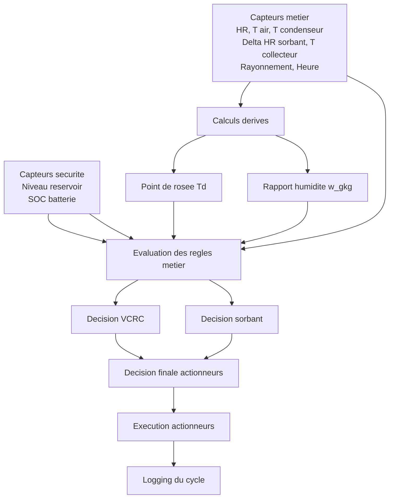
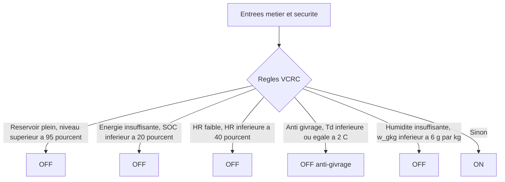
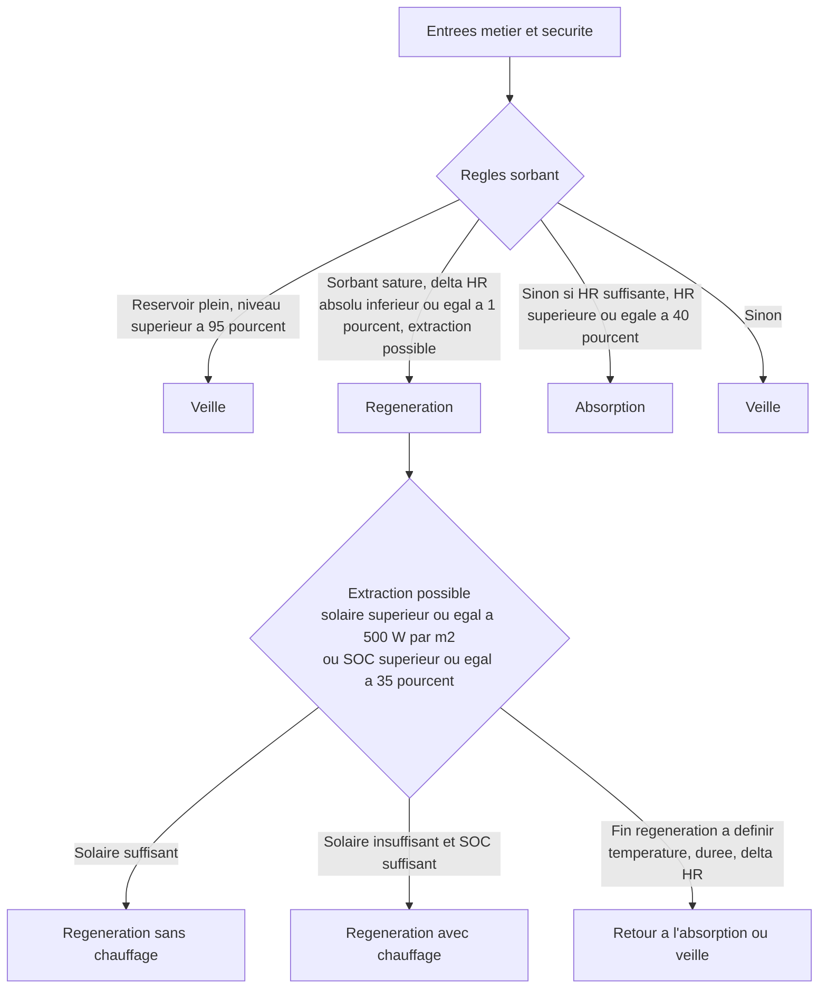
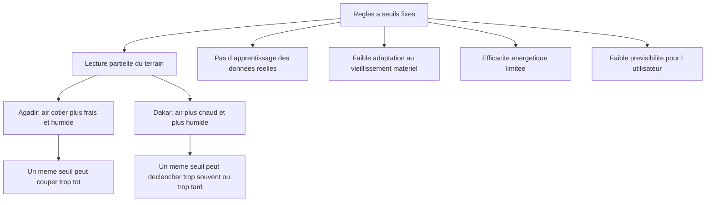
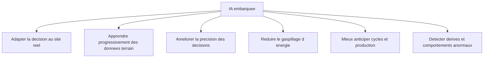
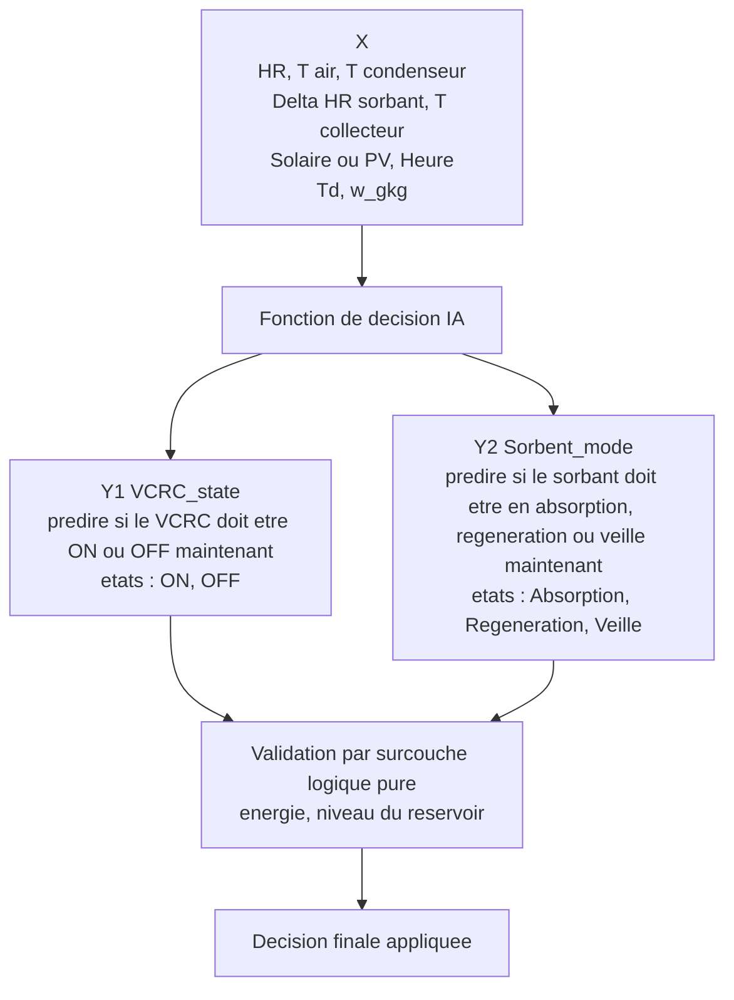
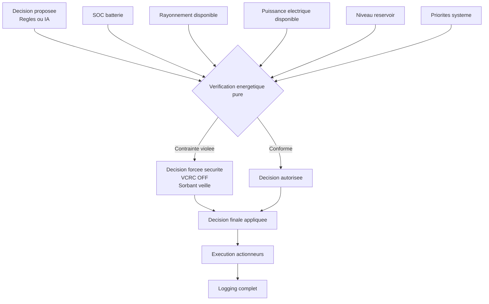
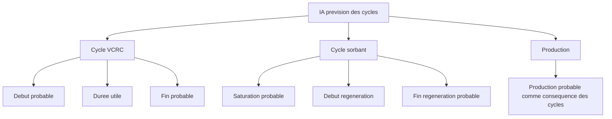

# AQUA-ATMOS - Decision Schemas

## Global View Without AI

## Regles Metier VCRC

## Regles Metier Sorbant

## A Discuter - Points D Ombre

- Oscillations autour des seuils:
  sans hysteresis, le systeme peut basculer trop souvent entre ON et OFF
- Saturation sorbant:
  le delta HR seul peut etre insuffisant ou trop bruite pour conclure
- Fin de regeneration:
  le critere operationnel reste a fixer clairement
- Vision partielle de l energie:
  le SOC ne represente pas toute la puissance reellement disponible
- Energie insuffisante:
  il faut preciser comment combiner batterie faible et ensoleillement insuffisant
- Robustesse capteurs:
  il faut anticiper bruit, derive, retard ou panne de mesure

## Pourquoi Ajouter L IA

## Ce Que L IA Peut Faire Concretement

## IA 1 - Reactivite Instantanee

## Surcouche Energetique Pure

## IA 2 - Prevision Des Cycles

