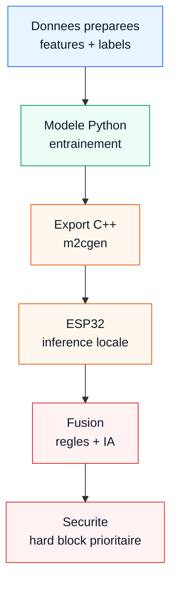

# Partie IA - contenu slide

Objectif de la slide : montrer la chaine reelle du projet, directement issue des notebooks et du code source.

## Structure conseillee

### 1. Donnees

**Titre court**
Donnees d'apprentissage

**Description**
Donnees climatiques et cycles synthetiques prepares pour entrainer les modeles.

**Source code**
- `notebooks/02_visualisation_climat_et_synthetique.ipynb`
- `notebooks/03_pretraitement_pour_entrainement.ipynb`
- `data/processed/training_dataset_prepared.csv`

**Visuel recommande**
Petit tableau colore depuis le dataset prepare.

```python
import pandas as pd

df = pd.read_csv("../data/processed/training_dataset_prepared.csv")

cols = [
    "hour",
    "temp_air_c",
    "hr_pct",
    "solar_wm2",
    "soc_battery_pct",
    "reservoir_level_pct",
    "vcrc_state",
    "sorbent_mode_label",
    "heater_on_label",
]

display(
    df[cols]
    .head(6)
    .style
    .background_gradient(
        subset=["temp_air_c", "hr_pct", "solar_wm2", "soc_battery_pct"],
        cmap="Blues",
    )
    .format(precision=1)
)
```

Version plus compacte si la colonne est trop large :

```python
compact_cols = [
    "hour",
    "temp_air_c",
    "hr_pct",
    "solar_wm2",
    "vcrc_state",
    "sorbent_mode_label",
]

display(
    df[compact_cols]
    .head(6)
    .style
    .background_gradient(subset=["temp_air_c", "hr_pct", "solar_wm2"], cmap="Blues")
    .format(precision=1)
)
```

### 2. Entrainement

**Titre court**
Modeles entraines

**Description**
Les modeles apprennent a predire les etats logiques : VCRC, mode sorbant, chauffage.

**Source code**
- `notebooks/04_entrainement_et_benchmark_modeles.ipynb`
- `data/modeling/benchmark_test_results.csv`
- `data/modeling/selected_models.csv`

**Resultats test a afficher**

| Cible | Modele | Accuracy test |
|---|---:|---:|
| VCRC | hist_gradient_boosting | 98.3% |
| Mode sorbant | hist_gradient_boosting | 98.0% |
| Chauffage | hist_gradient_boosting | 99.7% |
| Saturation sorbant | random_forest | 99.6% |

**Visuel recommande**
Utiliser la matrice de confusion deja presente dans le notebook 04. Elle montre que le modele apprend : les predictions restent concentrees sur la diagonale.

Cellule existante dans le notebook :

```python
from sklearn.metrics import confusion_matrix

for row in best_models.itertuples(index=False):
    target_name = row.target
    model_name = row.selected_model
    pipeline = fitted_models[target_name][model_name]
    y_pred = pipeline.predict(X_test)

    labels = sorted(y_test[target_name].unique().tolist())
    matrix = confusion_matrix(y_test[target_name], y_pred, labels=labels)
    plt.figure(figsize=(7, 6))
    ax = plt.gca()
    sns.heatmap(matrix, annot=True, fmt="d", cmap="Blues", cbar=False, ax=ax)
    ax.set_title(f"{target_name} - {model_name}")
    ax.set_xlabel("Prediction")
    ax.set_ylabel("Verite")
    ax.set_xticklabels(labels)
    ax.set_yticklabels(labels)
    plt.tight_layout()
    plt.show()
```

### 3. Resultat embarque

**Titre court**
IA sur ESP32

**Description**
Les modeles sont exportes en C/C++ puis appeles localement par le firmware ESP32.

**Source code**
- `scripts/export_models.py`
- `firmware/esp32/include/control/generated/`
- `firmware/esp32/include/control/inference_engine.h`
- `firmware/esp32/include/control/rule_engine.h`

**Mermaid style identique a `schema_electronique.md`**



## Phrase de conclusion

L'IA aide a choisir le bon mode de fonctionnement, mais elle ne commande jamais seule : les regles et les securites gardent le controle.
