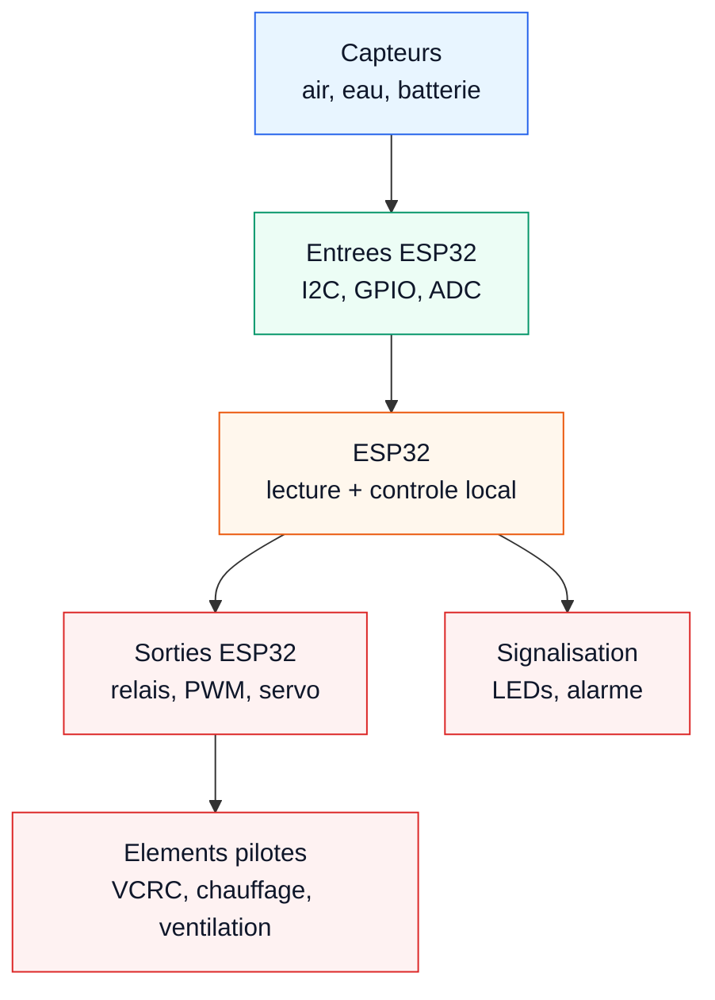

# Schema electronique - AQUA-ATMOS

Ce schema est concu pour etre place a droite de la photo du prototype. Il reste compact et montre les grands blocs electroniques sans reprendre le pipeline complet deja presente en slide A2.

## Lecture rapide

Les capteurs arrivent sur les entrees de l'ESP32. La carte centralise les signaux et pilote les sorties adaptees aux elements physiques. Cette vue reste volontairement generale : le detail acquisition, calculs, securite, decision et actionneurs est traite dans la slide A2.
