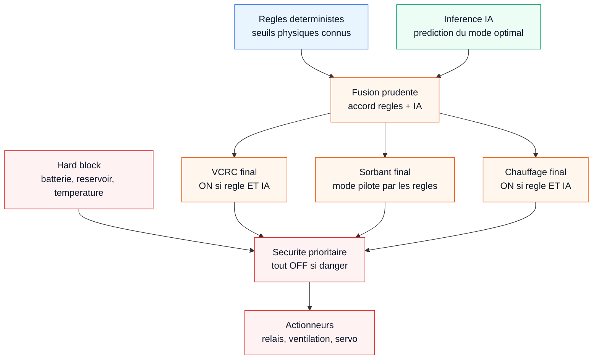

# Fusion regles + IA - AQUA-ATMOS

Ce schema est concu comme un zoom sur le bloc `Fusion` du pipeline. Il explique comment les regles deterministes, l'IA et les securites sont combinees avant l'action physique.

## Lecture rapide

L'IA ne commande pas directement la machine. Les regles deterministes restent la base explicable, l'IA confirme ou affine certaines decisions, puis les securites peuvent encore bloquer les sorties avant les actionneurs.

## Message slide

L'IA propose, les regles valident, la securite garde le dernier mot.
